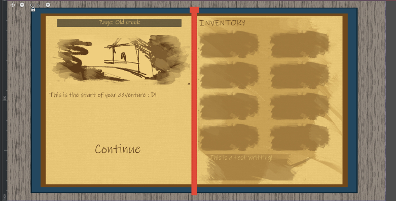

The source code for myras book game that is in development. The source code was exposed for portfolio purpose only.

The code can be accessed in MyrasBook/Assets/Runtimes
The editor tool can be access via : Tools/Hollow/Open Hollow editor

## What is myras-book?
Myras book is an 2D adventure horror game that is strongly
similar to an text adventure game, but is explored like if you
were reading a book and jump accross the story with the power of bookmarks

Myras book is currently at its third Prototype Iteration phase.

## Prototype 1 : 
###### Main game loop design.
The first iterations of Myras book was written in Ceramic using the Haxe language. It 
was an early wip to test the overall story flow and the main core mechanic of Myras :
Bookmark jumping. 
It was quickly moved to Godot as lack of GUI tools made the work complicated.

## Prototype 2: 
###### Godot implementations and UI design
The second iterations of Myras prototype was transfered to the Godot game engine.
It allowed to develop the overral GUI and improve on the Node System, which use 
an combination of linked list and a directed graph algorithm.
It was however switched to Unity has weird behaviour/ limitations and bugs was restricting the development.

## Prototype 3:
###### Unity integrations and tooling development

The third and current prototype iterations of Myras was originally not planned to be
ported to Unity. Actually, Unity was planned to be only used as tooling Solutions with 
Odin inspector as it would have helped the creations of the story node system data which was
originally written in json. but, it quickly became an heavy hurdle as Godot tooling
was not convenient with lack of proper documentations for editor plugins.

Hence, the game was quickly ported  to Unity which allowed to bring important
aspect to Myras development : an database editor to write the story data.

The code was also rewritten to Unity standard workflow but also undergo an heavy refactoring to allow two importants factor :
* project scallability and modularity
* to comform to the polymorphism pattern.

With that it allowed to quickly be able to add new features without affecting the technical debt to much.

The json system was also abandonned in favor of an easy to extends ScriptableObject structure which allowed to quickly  iterate new Story nodes (i.e an choice node).
The addition of addressables to the pipeline also helped quickly in term of assets Management.

Although in this current iterations UI / gameplay features were halted in favor to create a strong fondation and the main focus is currently on the editor.

After the editor will be finished and stable, the main goal will be 